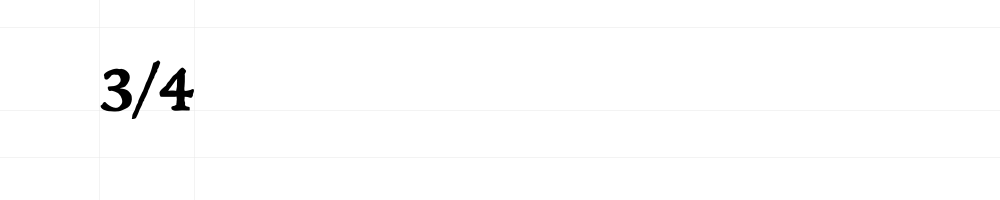
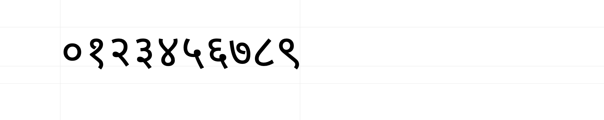

# FontRenderDiff

**This project, with the exception of the Noto-2019 directory, is confidential information of Lindenberg Software LLC.**

This project provides the command line FontRenderDiff, which produces font proof images that can be used to verify, document, and track over time the rendering results of a font. The tool uses the CoreText APIs on macOS.

The tool takes three or four arguments:

- The name of the file containing the font to be tested.
- If the font file name has the extension “.ttc”, then the PostScript name of the font to be tested.
- The name of the file containing a list of strings to be rendered with the font. The strings may come with instructions to select font features.
- The name of the directory in which the font proof images are to be kept.

The tool creates an image for each string in the test string file. If the image directory doesn’t contain an image for this string with the given features yet, the image is saved in the image directory. If the image directory contains an image already, the old and new image are compared, and a “diff” image highlighting the differences is saved. The tool also reports any test strings for which old and new images differ.

## Tool usage

While developing a font, keep a file with strings that test interesting aspects of the font: Glyph shapes, spacing, contextual glyph reordering or substitution, or mark positioning. When making changes, add strings so you can verify using the images generated by the FontRenderDiff tool whether the changes work. Discard new images that show incorrect behavior, revise the change, and run the tool again. Keep new images that show correct behavior.

When the tool generates a diff image, check whether the change is what you intended. If so, discard the old image and let the tool generate a new one. Otherwise, revise the change.

The tool is particularly useful when used together with a version control system, such as git. Commiting updates to the test strings file and new or updated images along with changes to the font lets you collect a detailed record of the development of the font.

## Building and running the tool

The project requires Xcode 10 and has been tested on macOS 10.14. To build it, open FontRenderDiff.xcodeproj in Xcode, then select `Build` from the `Product` menu. The tool will be installed in the *build* directory. You can then run it from the command line as `build/FontRenderDiff`, giving it the arguments described in the introduction. See [FontRenderDiff.sh](Examples/FontRenderDiff.sh) for sample usage.

## Test strings file

The test strings file is interpreted as follows:

1. For each line, any text starting with “//” is interpreted as a comment and discarded.
2. Any lines that, after discarding comments, are empty or contain only space characters are discarded.
3. If a line contains the character sequence “ ♦ ”, the section before this separator is treated as the test string and the section afterwards as an instruction. If a line doesn’t contain this separator, then the entire line is the test string. Only one instruction can be provided for each test string.
4. Within the test string, any character sequence starting with “\u{”, followed by one or more hexadecimal digits (0-9, A-F, a-f), followed by “}” is interpreted as a Unicode escape sequence and replaced with the Unicode code point that the hexadecimal digit sequence represents. The value of the hexadecimal digit sequence must be 0x10FFFF or less.
5. Leading and trailing space characters in the test string are discarded.
6. The following instructions are supported:
	- **nolig** – turn off all ligatures.
	- **dlig** – turn on discretionary ligatures.
	- **frac** – turn on the fractions feature.
	- **ordn** – turn on the ordinal digits feature.
	- **lang=_language_** – select the specified language, which may result in language specific glyphs or features to be enabled. The language must be specified as a [BCP-47 language tag](https://en.wikipedia.org/wiki/IETF_language_tag), not an OpenType language system tag.

### Examples:

The images in the following examples were generated using [FontRenderDiff.sh](Examples/FontRenderDiff.sh).

Neufville Digital’s version of Paul Renner’s Futura typeface, which is bundled with macOS, by default forms ligatures of “f” and “l”, but this can be turned off:

    Sauerstoffflasche
    Sauerstoffflasche ♦ nolig

James Grieshaber’s Trattatello font, which is bundled with macOS, supports diagonal fractions:

    3/4
    3/4 ♦ frac
    

Google’s [Noto Sans Devanagari](http://www.google.com/get/noto/) font has digit glyphs for Nepali that differ from the default glyphs used for Hindi, Marathi, and other languages:

    ०१२३४५६७८९
    ०१२३४५६७८९ ♦ lang=ne

## File names

The tool derives names for image files from the test string and, if provided, instruction:

1. If an instruction was provided, then the tentative file name is the concatenation of test string, “ ♦ ”, and the instruction. Otherwise, the tentative file name is just the test string.
2.  The tentative file name is brought into Unicode normalization form C. This means that canonically equivalent test strings, such as “ä” and “a\u{0308}” use the same file name, and it’s considered an error if the font renders such canonically equivalent test strings differently.
3. Characters in the tentative file name that might represent file separators are replaced with alternate strings: “/” with “@slash@”, and “:” with “@colon@”.
4. If the test string contains uppercase characters, “ ⇧” is appended to the tentative file name to reduce the chances of collisions with the file names of test images using the corresponding lowercase characters. This is insufficient if test strings use different permutations of upper- and lowercase characters.
5. If the font being tested is an AAT font, then the tool checks if there is a file whose name consists of the tentative file name plus “.AAT.png”. If so, then the generated image is compared with the content of that file. If the two differ, than a diff image is generated with a file name that consists of the tentative file name plus “.AAT.diff.png”, and we’re done.
6. The tool checks if there’s a file whose name consists of the tentative file name plus “.png”. If so, then the generated image is compared with the content of that file. If the two are equal, we’re done. If the two differ, than a diff image is generated with a file name that consists of the tentative file name plus “.diff.png”, and we’re done.
7. The tool writes the generated image to a file whose name consists of the tentative file name plus “.png”.

Files with suffix “.AAT.png” can be used occasionally for fonts that have OpenType shaping tables (GDEF/GSUB/GPOS) as well as AAT shaping tables (morx/kerx/ankr). For such fonts, you can use the tool to test both implementations – run it once before adding the AAT tables to test the OpenType implementation, then again after adding the AAT tables to test the AAT implementation, both times using the same directory for the test images. Normally you want both implementations to behave the same, so the same images are used. Sometimes, however, it’s not feasible to perfectly align the behavior of the two implementations. In such cases, you can create two separate images, one with the normal suffix “.png” for OpenType rendering, the other with the suffix “.AAT.png” for AAT rendering.
